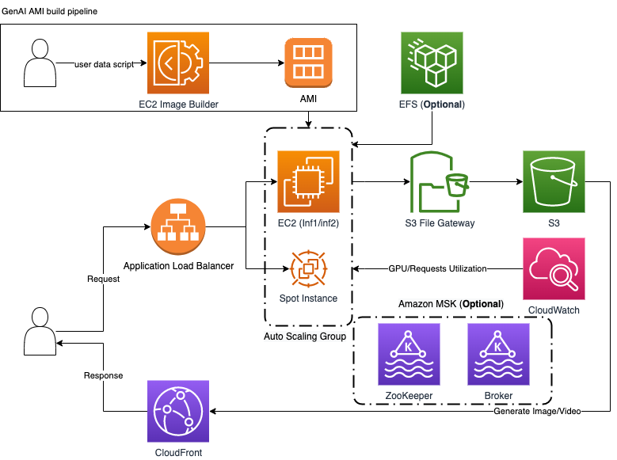

# Hosting GenAI Application on AWS EC2

For great flexibility and control, you can host Stable Diffusion WebUI/CompyUI/Other GenAI Application on AWS EC2. This tutorial will guide you through the process of setting up a scalable and cost-effective infrastructure to host Stable Diffusion WebUI/CompyUI/Other GenAI Application on AWS EC2.

## Key feature to consider

- Elastic scaling for 2C customer, the EC2 cluster will scale up to handle the request and vice versa when the request is high, the scaling time for a new EC2 instance come to available and ready to receive request should be under 2 minutes. The average launch time of EC2 instance is around 17-18 seconds according to benchmark ([benchmark script](./source/scripts/ec2-benchmark.sh))
- API support for application integration without awareness of the underlying framework and infrastructure, e.g. WebUI/CompyUI
- Optimized inference speed for 2C customer, the inference time should be around 2-3 seconds whether using asyn or syn mode
- Support for Spot instance to reduce the cost of running the cluster, careful consideration should be taken to ensure the cluster can handle the spot instance termination
- Model switching support, the cluster should be able to switch between different model without much waiting time, consider to load the model into memory then local cache to reduce the loading time and use S3 File Gateway or EFS to store the model
- Metric and logging support, the cluster should be able to provide the metric and logging for monitoring and debugging purpose, furthermore, the scaling activity is triggered by such metric, e.g. ([nvidia_smi_utilization_gpu](https://docs.aws.amazon.com/AmazonCloudWatch/latest/monitoring/CloudWatch-Agent-NVIDIA-GPU.html))
- Consider the concurrency of the cluster (Kafka as the message queue to distribute the request to different EC2 instance), the cluster should be able to handle the request from multiple customer at the same time, the concurrency of the cluster should be around 100 TPS (Transaction per second) for 2C customer, sync and async mode should be supported since text to video inference is a time consuming task
- Pack boilerplate AMI including all the necessary software and library to reduce the launch time of EC2 instance, the AMI should be able to launch the cluster with minimum configuration
- All generated images and videos will be stored in S3 bucket and user will get the link to the image and video by using S3 and CloudFront (CDN) to reduce the latency of the request and S3API cost
- Consider to use custom chip, e.g. AWS Inferentia, to reduce the cost of running the cluster

## Architecture



## Deployment
Make sure you have prepared the following resources before deploying the infrastructure:
- AWS credentials
- AWS CDK (Cloud Development Kit) installed
- Node.js installed

### Step 1: Clone the repository
```bash
git clone https://github.com/yike5460/anything-on-xc.git
```

### Step 2: Install Node.js
```bash
sudo apt update
sudo apt install nodejs
sudo apt install npm
```

### Step 3: Install AWS CDK
```bash
npm install -g aws-cdk
```

### Step 4: Deploy the infrastructure
```bash
cd source/infrastructure
npx cdk deploy
```

Such CDK will create the following resources:
- 1 EC2 instance with user data to launch the sample Stable Diffusion WebUI along with AWS extension, for the purpose to go through the process of setting up the infrastructure, e.g. mount s3fs, collect GPU metric and adjusting the configuration to boot your own application
- ASG with mixed instance policy to scale the EC2 instance, 1 on-demand instance and 1 spot instance, lifecycle hook to handle the spot instance termination
- (Optional) EC2 image build pipeline to iterate the AMI with full automation, the AMI will be used to launch the EC2 instance 
- (Optional) Lambda to monitor the hitorical spot instance price and update the launch templates spot instance configuration, however, such ec2.LaunchTemplateSpotOptions is not supported when using mixed instance policy since official provide built-in policy to handle the spot instance application, e.g. LOWEST_PRICE, CAPACITY_OPTIMIZED, etc.

## Note
- The transfer time of file from s3fs mounted folder to local EC2 folder is around 159 mb/s (e.g. sd xl base model, 6.5 * 1000 mb/41s) and the transfer time from local folder to s3fs mounted file is around 148 mb/s (6.5 * 1000 mb/44s)

- The transfer time of file from EFS mounted (efs.PerformanceMode.GENERAL_PURPOSE/efs.ThroughputMode.BURSTING) folder to local EC2 folder is around 89 mb/s (6.5 * 1000 mb/73s) and the transfer time from local folder to EFS mounted file is around 97 mb/s (6.5 * 1000 mb/67s)

- EFS mounted folder is using NFS protocol which is slower than s3fs mounted folder using S3API protocol judging from the transfer time. The possible reason for such speed can be the EFS is mounted in different AZ than the EC2 instance, the EFS is mounted in us-east-1a while the EC2 instance is in us-east-1b, the transfer time between different AZ is slower than the transfer time within the same AZ. The transfer time between different AZ is around 1.5x slower than the transfer time within the same AZ. Another possible reason is the EFS is mounted in BURSTING mode which is slower than PROVISIONED mode.
